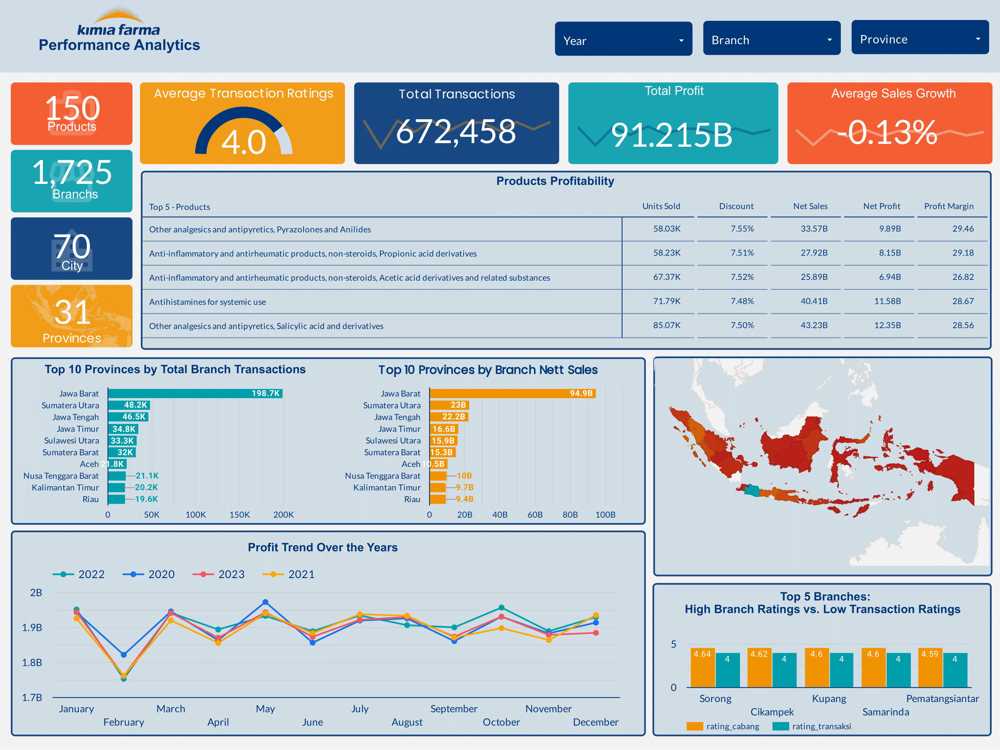

# Kimia Farma - Big Data Analytics Project
## About The Program
This project is final task of the Kimia Farma - Big Data Analytics Project Based Internship organized by Rakamin Academy. The program provides access to learning materials, including article reviews and company coaching videos. Along with the educational content, there are various tasks to complete, with this project serving as the final assignment.

## Project Overview
This project evaluates the business performance of Kimia Farma from 2020 to 2023. It involves processing and exploring the datasets to create an interactive dashboard, which is then analyzed to provide insights and recommendations.

## Tools & Technologies
* BigQuery: Used for processing and querying datasets efficiently
* Google Looker Studio: Utilized for creating the interactive dashboard that visualizes the results of the analysis

## Objectives
* Evaluate the business performance of Kimia Farma from 2020 to 2023 through data analysis
* Process and clean datasets to create an analysis table
* Explore key trends and patterns within the data to gain insights into business operations
* Develop an interactive dashboard
* Provide actionable insights and recommendations based on the data analysis to support business decision-making

## Dashboard
[Interactive Dashboard in Google Looker Studio](https://lookerstudio.google.com/s/ncvpUpqCuF8)

